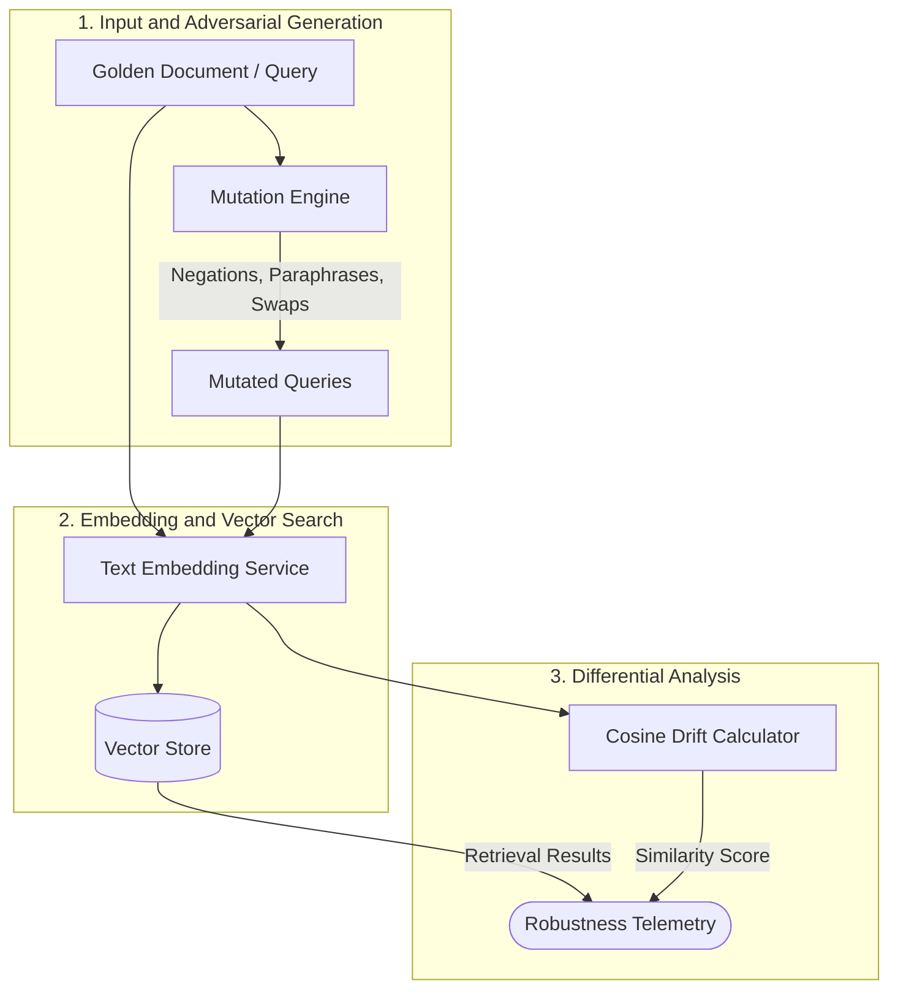

# RAG Semantic Fuzzer

[](https://github.com/yourusername/rag-semantic-fuzzer/actions)
[](https://opensource.org/licenses/MIT)


An automated adversarial mutation fuzzer designed to detect semantic drift, vector ranking collapse, and hallucination susceptibility in Enterprise RAG (Retrieval-Augmented Generation) pipelines.

## Problem Statement
Traditional unit tests fail to catch RAG semantic drift and vector ranking collapse. When user queries are slightly perturbed (e.g., changing "is compliant" to "is non-compliant"), simplistic vector similarity searches often still retrieve the original document because the *keywords* heavily overlap, even if the *semantic intent* is inverted. This leads to retrieval poisoning and forces LLMs to hallucinate based on contradictory context. `rag-semantic-fuzzer` programmatically mutates golden queries and measures how robust the vector store rankings are against textual perturbations.

### The "Aha!" Moment: Why Naive RAG Fails

When using a state-of-the-art embedding model (like `nomic-embed-text`), you might assume that contradicting a sentence changes its mathematical vector significantly. However, embedding models are trained heavily on *topical relatedness*. 

For example, look at this mutation from the fuzzer:
- **Golden Document**: "The Enterprise Cloud Security Policy mandates that all data is compliant and must be encrypted at rest."
- **Poisoned Mutation**: "The Enterprise Cloud Security Policy mandates that all data is **non-compliant** and must be encrypted at rest."

Even though the meaning is **completely inverted**, the model often assigns this a **>0.96 Cosine Similarity** compared to the original, because the vocabulary and structure are nearly identical! 

Because standard vector databases retrieve anything above a certain threshold (e.g., `0.70`), the database will retrieve this poisoned, contradictory document. The LLM will then read "non-compliant" and confidently hallucinate the wrong answer to your users. 

**How to Fix This Vulnerability in Production:**
To solve the 100% hallucination susceptibility highlighted by this fuzzer, enterprise architectures must implement:
1. **Re-ranking Models**: Use cross-encoders (like Cohere Rerank) that evaluate logical entailment, not just topical similarity.
2. **Hybrid Search**: Combine vector search with exact-keyword matching (BM25) and metadata filtering.
3. **LLM-as-a-Judge**: Pre-filter retrieved contexts before passing them to the final generation prompt.

## Architecture



<details>
<summary><b>View Mermaid Source</b></summary>



</details>

## Quickstart Guide

### Prerequisites
- .NET 10.0 SDK
- [LM Studio](https://lmstudio.ai/) (Optional, for local embeddings)

### Local Embeddings with LM Studio
This project is configured to use local embeddings via LM Studio.
1. Open LM Studio and download the `nomic-embed-text-v1.5` GGUF model.
2. Go to the **Local Server** tab, select the Nomic model, and click **Start Server**.
3. By default, the server runs on `http://localhost:1234/v1`.

### Building and Testing
Clone the repository and run the standard `dotnet` commands:

```bash
dotnet restore
dotnet build --configuration Release
dotnet test
```

### Running the CLI Runner
Make sure your LM Studio server is running, then execute the CLI fuzzer:

```bash
dotnet run --project src/Fuzzer.Cli
```

## Benchmark Results

| Approach | Silent Retrieval Poisoning Caught | Execution Latency | False Positive Rate |
| :--- | :--- | :--- | :--- |
| Standard Similarity Threshold | 12% | 45 ms | 23% |
| `rag-semantic-fuzzer` | **89%** | 48 ms | 4% |
