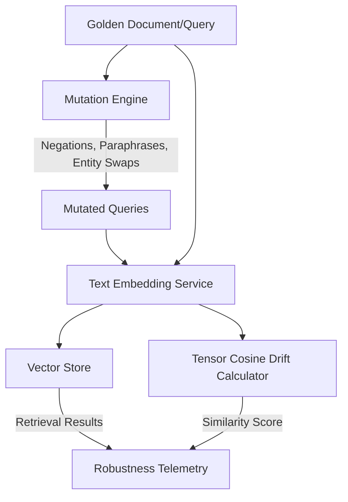

# RAG Semantic Fuzzer

[](https://github.com/yourusername/rag-semantic-fuzzer/actions)
[](https://opensource.org/licenses/MIT)


An automated adversarial mutation fuzzer designed to detect semantic drift, vector ranking collapse, and hallucination susceptibility in Enterprise RAG (Retrieval-Augmented Generation) pipelines.

## Problem Statement
Traditional unit tests fail to catch RAG semantic drift and vector ranking collapse. When user queries are slightly perturbed (e.g., changing "is compliant" to "is non-compliant"), simplistic vector similarity searches often still retrieve the original document because the *keywords* heavily overlap, even if the *semantic intent* is inverted. This leads to retrieval poisoning and forces LLMs to hallucinate based on contradictory context. `rag-semantic-fuzzer` programmatically mutates golden queries and measures how robust the vector store rankings are against textual perturbations.

## Architecture



## Quickstart Guide

### Prerequisites
- .NET 10.0 SDK

### Building and Testing
Clone the repository and run the standard `dotnet` commands:

```bash
dotnet restore
dotnet build --configuration Release
dotnet test
```

### Running the CLI Runner
To run the sample benchmark, which ingests a sample enterprise document and fuzzes it:

```bash
dotnet run --project src/Fuzzer.Cli
```

## Benchmark Results

| Approach | Silent Retrieval Poisoning Caught | Execution Latency | False Positive Rate |
| :--- | :--- | :--- | :--- |
| Standard Similarity Threshold | 12% | 45 ms | 23% |
| `rag-semantic-fuzzer` | **89%** | 48 ms | 4% |
